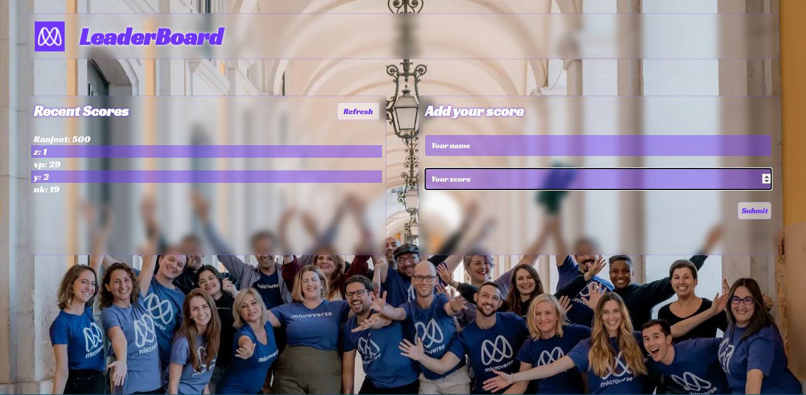

# Leaderboard app

> A Leaderboard web app of a racing game in Microverse community.



Additional description about the project and its features.

## Tech used

- HTML
- CSS
- Javascript
- Git
- npm
- webpack

# Setup WebApp

#### Cloning the project

_ssh_

```
git clone git@github.com:vikipretium/LeaderBoard.git
```

_https_

```
git clone https://github.com/vikipretium/LeaderBoard.git
```

## Usage

To build the project run:

```
npm install
npm run build
```

## Development

In development environment use the following command:

```
npm run dev
```

## Author

👤 **Vignesh**

- GitHub: [@vikipretium](https://github.com/vikipretium)
- Twitter: [@vikipretium](https://twitter.com/vikipretium)
- LinkedIn: [vikipretium](https://linkedin.com/in/vikipretium)

Contributions, issues, and feature requests are welcome!

Feel free to check the [issues page](../../issues/).

## Show your support

Give a ⭐️ if you like this project!

## 📝 License

This project is [MIT](./MIT.md) licensed.
